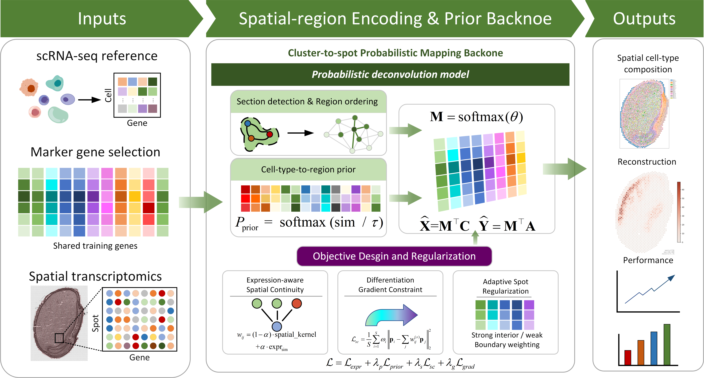
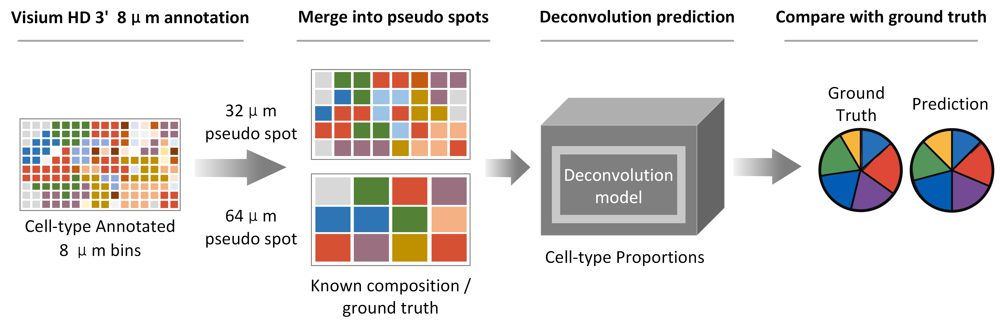

# PlantDeconv

PlantDeconv is a structure-guided probabilistic deconvolution framework for analyzing cell-type composition in plant spatial transcriptomics data.

## Overview

Spatial transcriptomics provides a powerful strategy for resolving plant cell composition and developmental states within native tissue contexts. However, many sequencing-based spatial platforms measure multiple cells within each spot, making cell-type deconvolution necessary. Existing deconvolution methods are mainly designed for animal tissues or general tissue assumptions, and often do not explicitly use plant-specific spatial structures such as anatomical regions, layered organization, cell-wall-constrained spatial patterns, tissue boundaries, and continuous developmental gradients.

PlantDeconv addresses this problem by integrating single-cell reference data, spatial transcriptomics data, region-aware priors, expression-aware spatial continuity, differentiation-gradient constraints, and adaptive spot-level regularization into a unified probabilistic deconvolution model.

## Model Framework



PlantDeconv takes two main inputs:

- A single-cell RNA-seq reference dataset with cell-type annotations
- A spatial transcriptomics dataset with spot-level gene expression and spatial coordinates

The framework first selects marker genes from the single-cell reference and identifies shared training genes between the single-cell and spatial datasets. It then builds spatial-region metadata, estimates cell-type-to-region priors using marker-driven pseudobulk similarity, and performs cluster-to-spot probabilistic mapping.

The core model estimates a cell-type composition matrix for each spatial spot and reconstructs spatial gene expression using the learned mapping. PlantDeconv introduces three structure-aware regularization components:

1. **Expression-aware spatial continuity**  
   Encourages neighboring spots with similar expression profiles to have similar cell-type compositions.

2. **Differentiation-gradient constraint**  
   Models continuous developmental transitions along spatial or anatomical gradients.

3. **Adaptive spot regularization**  
   Applies stronger regularization in homogeneous tissue regions and weaker regularization near complex boundaries.

These components help reduce unrealistic spatial diffusion and improve anatomical consistency in plant tissues.

## Benchmark and Testing Strategy



The model can be evaluated using pseudo-spot benchmarks generated from high-resolution spatial annotations. In this testing strategy, annotated spatial bins are merged into larger pseudo spots, such as 32 μm or 64 μm pseudo spots. Since the original cell-type annotations are known, the true cell-type composition of each pseudo spot can be calculated and used as ground truth.

PlantDeconv predicts the cell-type proportions for each pseudo spot, and the predicted composition is compared with the known ground-truth composition. This enables quantitative evaluation of deconvolution performance under different spatial resolutions and spot sizes.

## Code Workflow

The main pipeline is implemented in `main.py`. The workflow contains the following steps:

### 1. Configure input files

The user should modify the paths in `main.py` to match their own datasets:

```python
SC_H5AD = Path("path/to/single_cell_reference.h5ad")
ST_H5AD = Path("path/to/spatial_data.h5ad")
HE_IMAGE_PATH = Path("path/to/tissue_hires_image.png")
OUTPUT_DIR = Path("path/to/output_directory")
